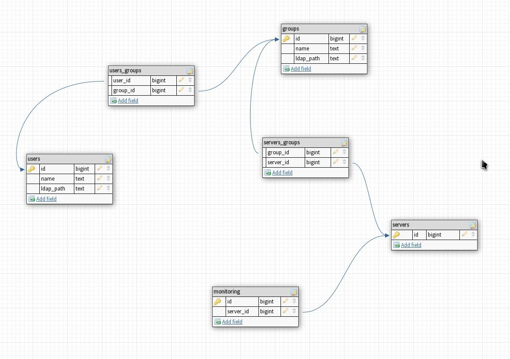

# API Core of Laravel VPN Admin

This project is the root component of the "Laravel VPN Admin" project,
based on the Laravel framework, interaction with other modules of the
system occurs via the GraphQL protocol.

## Database schema

The database has a very simple structure, the main task of the 
database is to store information about the list of users, servers.
groups as well as the connections between them, and of course
monitoring messages.

 
## Requirements
 
* TDD conception of development
* Plugins:
  * Lighthouse - GraphQL
  * GraphQL playground
  * Laravel Passport (?) - Authorization
* Active Directory support

## TODOs

* [ ] Laravel Auth:API
* [ ] GraphQL authorization
* [x] Vue router

## Testing

> Please, do not run tests on production environment!

Preconfigure your development environment

    cp .env.example .env

Then prepare your database

    ./artisan migrate:fresh --seed

Then run tests

    ./vendor/bin/phpunit
